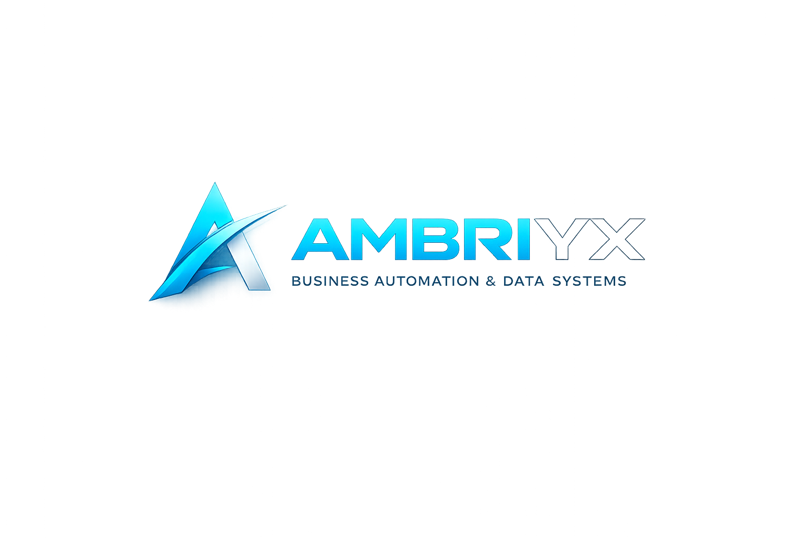

<div align="center">
  
  <h1>Ambriyx</h1>
  <p><strong>Business Analytics &bull; Industrial Intelligence &bull; Data-Driven Growth</strong></p>
  <br />
  <p>
    <a href="#-the-late-night-truth">The Late Night Truth</a> &bull;
    <a href="#-what-we-do">What We Do</a> &bull;
    <a href="#-how-this-site-is-built">The Build</a> &bull;
    <a href="#-join-us">Come, Sit With Us</a>
  </p>
</div>

---

## 🌃 The Late Night Truth

You're sitting in your office. It's past midnight.

The factory floor went silent hours ago. The machines that roared all day are resting. Your workers have gone home. The night guard's footsteps echo somewhere in the yard.

And you're still here.

Because again this month — the numbers don't add up.

Your turnover looks good on paper. Crores coming in. Trucks going out. Orders piling up. On paper, things are beautiful.

But then you open your bank statement and something twists inside you.

*Where did it all go?*

You scroll through Excel sheets that no one fully understands. You flip through invoices that seem to multiply on their own. You stare at Profit & Loss reports that feel like a foreign language — written by someone who doesn't know your business, doesn't know your struggle, doesn't know the sweat that goes into every single unit you ship.

Your father ran this business with instinct. You're running it with Excel. And somehow, both feel like you're running blind.

---

That night — that exact feeling of sitting alone with numbers that refuse to tell the truth — is where Ambriyx was born.

Not in a boardroom. Not at a conference.

On the factory floor. At 2 AM. In the silence between two shipments.

Our founder, Ambikesh, was 22 when he started this.

No MBA. No family business background. No grey hair from 30 years on the factory floor. Just a laptop, a restless curiosity, and the strange ability to look at a pile of numbers and see the story hiding inside.

He started by asking a simple question to every business owner he could reach:

> *"Can you show me your numbers? I don't want to sell you anything. I just want to see if I can find something you've missed."*

Most said no. Some said yes.

One of them — a manufacturer who had been running his unit for 27 years — spread out his ledgers like a doctor laying out X-rays. He was skeptical. A 22-year-old telling him about *his* business?

Ambikesh pointed at a product line and said: *"This one. You think it's your best seller. But after returns, discounts, and the raw material spike last quarter — it's actually running at a loss."*

The man checked. He went silent for a long time.

That's when Ambikesh realized: **age doesn't find the truth. Data does.**

He hadn't worked in a factory. But he understood numbers. And numbers, when read right, never lie.

### The World Doesn't Need Another Dashboard

There are a thousand tools that can draw charts. Power BI, Tableau, Looker — they're all brilliant. They can turn numbers into rainbows.

But none of them can sit across from you and say:

> *"This product line is killing your margin. This customer hasn't paid in 74 days. This expense category has doubled without you noticing. And here — right here — is ₹12 lakh leaking every quarter from a place you never thought to look."*

That's what we do.

We don't just give you a dashboard. We give you a **truth-teller**. Someone who speaks your language — Hindi, English, Gujarati, or the language of profit & loss. Someone who treats your business like it's their own.

**We sit with you. We look at every number. And we tell you exactly what's happening, what's bleeding, and what to do about it.**

No jargon. No complexity. Just clarity.

---

### What Your Business Deserves

You've built something real. You've employed families. You've kept machines running through power cuts, market crashes, and pandemics.

You deserve to know:

- **Which products actually make money** — and which ones are quietly draining you
- **Where every single rupee goes** — because small leaks sink big ships
- **Exactly how much profit you really made** — not what the GST filing says, but the real number
- **Where your next growth opportunity hides** — because data doesn't lie, it points

---

## 🚀 What We Do

| Service | What It Really Means |
|---|---|
| **Sales & Revenue Analytics** | Stop guessing. Know what's selling, when, and why — down to the last unit. |
| **Profit & Loss Intelligence** | See exactly where money enters, where it leaks, and who's stealing your margin (spoiler: it's usually a product, not a person). |
| **Operational Dashboards** | One screen that tells you everything — production, inventory, dispatch, workforce. Real-time. On your phone. |
| **Data Integration** | ERP, billing software, Excel sheets, bank statements, handwritten records — we connect it all into one pipeline. |
| **Growth Forecasting** | Next quarter, next year — planned with data, not hope. |
| **BA Outsourcing** | Your own dedicated business analyst. Monthly reports. Strategy calls. Like having a CFO without the CFO salary. |
| **GST & Tax Reconciliation** | Catch mismatches before the notice arrives. Claim credits you didn't know you were missing. |
| **Cash Flow Analysis** | Never be surprised by a cash crunch again. |
| **Inventory Optimization** | Free up the lakhs of rupees sitting dead in your warehouse. |
| **Vendor Analytics** | Know which vendors overcharge, which deliver late, and who deserves more business. |
| **Pricing Strategy** | Find the price that maximizes both sales and margin — backed by data, not gut feel. |
| **Loan Support** | Bank-ready financial statements that get you approved faster. |

> 📍 Starting at **$120/month** — includes live dashboard, monthly reports, and a monthly strategy call. No hidden costs. No lock-in.

---

## 🛠️ The Build

This website is our home on the internet — a single-page landing site, hosted on **GitHub Pages**, built with love and vanilla JavaScript (no frameworks, no bloat).

### What's Under the Hood

| Layer | What We Used |
|---|---|
| **Structure** | HTML5 |
| **Style** | CSS3 — custom properties, glassmorphism, fluid layouts |
| **Brains** | Pure JavaScript (770+ lines, zero dependencies) |
| **Canvas** | Custom particle network — those floating dots? That's us. |
| **Counting** | CountAPI (visitor counter that updates in real time) |
| **Forms** | Google Apps Script — submissions land straight in Sheets |
| **Fonts** | Inter + JetBrains Mono from Google Fonts |

### What This Site Can Do

- **Live Visitor Counter** — every visit counts. You can see it at the top.
- **Live Request Counter** — every form submission adds to the number in real time.
- **Smart Chatbot** — asks you questions, suggests what to ask, and redirects you to Ambikesh when it's out of its depth.
- **English / Hindi Toggle** — full site translation with one click. It remembers your choice.
- **System-Aware Theme** — light mode if your system is light, dark mode if it's dark. Feels like it belongs.
- **Animated Particles** — subtle network visualization that responds to your mouse.
- **Dashboard Carousel** — see exactly what your dashboard could look like.
- **Smooth Scroll Reveals** — elements fade and slide as you scroll, powered by IntersectionObserver.
- **Mobile-First** — hamburger menu, overlay backdrop, touch-friendly everything.
- **FAQ Accordion** — because the question you have is probably already answered.
- **Booking Form** — book a free call. We'll call you within 24 hours. Promise.

### Project Map

```
├── index.html        # Everything you see
├── styles.css        # The skin & soul (930+ lines)
├── main.js           # The brain (770+ lines)
├── logo.png          # Our face
├── opencode.jsonc    # Config
└── .github/          # Automation
```

---

## 🤝 Come, Sit With Us

Ambriyx isn't a company. It's a **promise**.

A promise that your business data will finally make sense. That you'll stop feeling like numbers are against you. That someone will sit beside you — literally or virtually — and decode the chaos.

### 👨‍💼 If You Own a Business

You've done the hard part. You built something real. Now let us help you see it clearly.

- 📞 **Call / WhatsApp:** [+91 9129451978](tel:+919129451978)
- 📧 **Email:** [abhay2004raj15@gmail.com](mailto:abhay2004raj15@gmail.com)
- 📸 **Instagram:** [@Ambikesh.py](https://www.instagram.com/Ambikesh.py)
- 💼 **LinkedIn:** [Ambikesh Srivastava](https://www.linkedin.com/in/ambikesh-srivastava-2416992a0/)
- 🌐 **Or just hit "Book Appointment" on our site** — the button that glows. You can't miss it.

We offer a **free 30-minute discovery call**. No pitch. No pressure. Just honest advice about your numbers.

### 💻 If You're a Builder

You believe data can change the world. So do we.

We're looking for:
- **Data analysts** who love messy industrial data
- **Frontend developers** who worship clean, fast design
- **Storytellers** who can turn pivot tables into poetry
- **Dreamers** who want to build something that actually matters

Fork the repo. Send a PR. Open an issue. Or just reach out and say hi.

> *"I'm 22. I haven't run a factory. But I've read enough business data to know that numbers tell the truth — and the truth can fix anything."* — Ambikesh

---

<div align="center">
  <br />
  <p><strong>Ambriyx</strong> &mdash; Data-driven decisions for the people who build the world.</p>
  <p>
    <a href="https://www.instagram.com/Ambikesh.py">Instagram</a> &bull;
    <a href="https://www.linkedin.com/in/ambikesh-srivastava-2416992a0/">LinkedIn</a> &bull;
    <a href="tel:+919129451978">Call Us</a>
  </p>
  <br />
  <sub>&copy; 2026 Ambriyx. Made with late nights, black coffee, and the belief that every business deserves to know its own truth.</sub>
</div>
